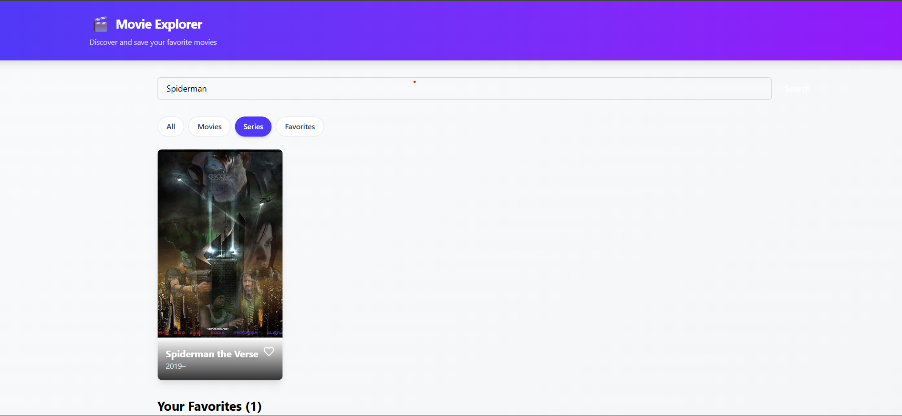

<h1 align="center" id="title">Movie Search</h1>

<p id="description">This project is a React-based web application that allows users to search for movies and series using the OMDb API. Users can filter results by type (movies series favorites) and mark movies as favorites which are saved in the browser’s local storage for persistence</p>

  


  
<h2>🧐 Features</h2>

Here're some of the project's best features:

*   Movie Search: Users can search for movies or series by entering keywords.
*   Favorites Management: Users can add or remove movies from their favorites list. Favorites are saved in local storage to keep them across sessions.
*   Responsive UI: The app has a clean and responsive layout that works well on different devices.
*   Error Handling & Loading States: Shows user-friendly messages when no movies are found or when loading data.

<h2>🛠️ Installation Steps:</h2>

<p>1. Clone the repository</p>

```
git clone https://github.com/Sauravpant/Movie-Search.git
```
<p>2. Navigate to project folder</p>

```
cd Movie-Search
```
<p>3. Install the dependencies</p>

```
npm install
```

<p>4. Set up an .env file in the root folder (Same level as package.json)</p>

```
VITE_OMDB_API_KEY=your_omdb_api_key
```

```
VITE_OMDB_API_URL=http://www.omdbapi.com/
```

<p>5. Run the app locally</p>

```
npm run dev
```

  
  
<h2>💻 Built with</h2>

Technologies used in the project:

*   TypeScript
*   React.js
*   TailwindCSS